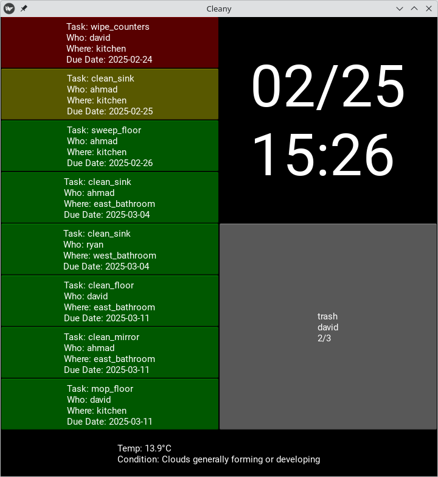

# Cleany

No-frills Kivy app for assigning household cleaning tasks amongst roomates (also displays the time and weather). Build configured on Android.




## Desktop
The app is currently configured to run on both desktop and android. This section includes instructions for desktop.

### Installation

Run

```
./app.sh install
```

### Run the app

```
source ./app.sh venv
./app.sh run
```


See [app.sh](app.sh) for more useful commands.

## Android

To deploy the application on a connected android device, first follow [the installation instructions above](#installation). Then run

```
./app.sh android deploy
```

See the android section in [app.sh](app.sh) for other useful commands.

## Development / Contribution

To get started with development, first follow [the installation instructions above](#installation).

### Linting


Always lint before pushing new code changes:

```
./app.sh lint
```

### Enhancements

The application was written in a few days as a personal project, hence the no-frills design and lack of unit tests. Some potential improvements:

- [ ] Unit tests
- [ ] Prettier design (though preferably without costly animations and graphics like too much software these days )
- [ ] Work on iOS
- [ ] Work on devices of various sizes (I've only tested it on a Kindle Fire)
- [ ] Test on rPi
- [ ] Cleaner data storage mechanism (or at least condense data into one file)
- [ ] Build process to output .apk file
- [ ] .apk file from build process saved as Github artifact with Github workflow.
- [ ] Custom icons, splash screen. Right now it just uses the Kivy defaults.

The above list shall not be added to, only removed from. Any new feature requests or bug reports should be submitted in GitHub issues.